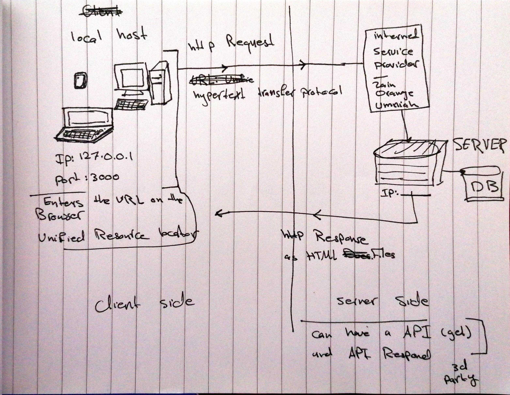
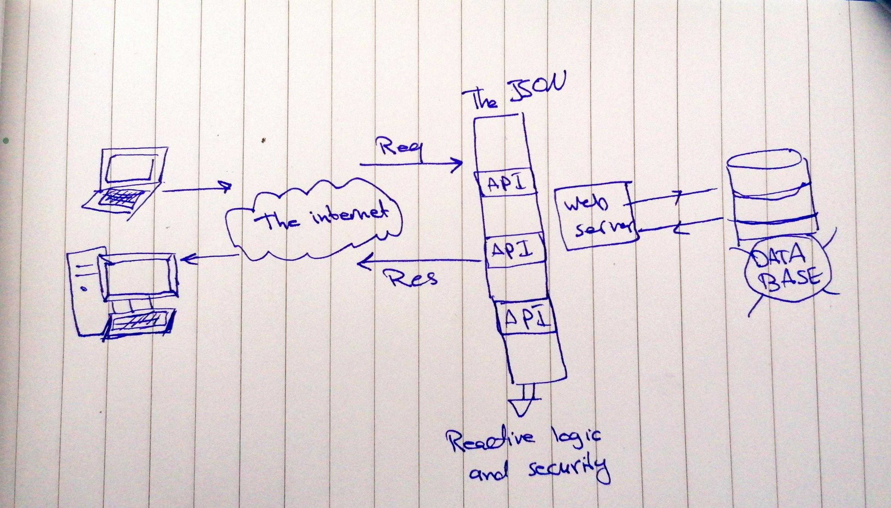

# Movies-Library

# Project Name - Project Version

**Author Name**: Ghaida Al Momani / Movies Library System

## WRRC

## Overview

## Getting Started
<!-- What are the steps that a user must take in order to build this app on their own machine and get it running? -->

## Project Features

## API Documentation
***
API Overview
Our API is available for everyone to use. A TMDB user account is required to request an API key. Professional users are approved on a per application basis.

As always, you must attribute TMDB as the source of your data. Please be sure to read more about this here.

API Documentation
To view all the methods available, you should head over to developers.themoviedb.org. Everything outlined on this page is simply a high level overview to help you understand what is available.

Why would I need an API?
The API provides a fast, consistent and reliable way to get third party data
***

**--
You can search movies, List your favourite movies 
Add , Delete, and update any movie.
Also you can display a specific movie or all of them.
--**

